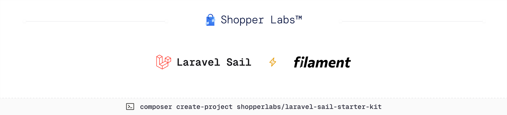

<a href="https://shopperlabs.co/" target="_blank">
  <picture>
    <source media="(prefers-color-scheme: dark)" srcset="art/banner-dark.png">
    
  </picture>
</a>

<p>
    <a href="https://php.net"></a>
    <a href="https://laravel.com"></a>
    <a href="https://filamentphp.com"></a>
    <a href="https://packagist.org/packages/shopperlabs/laravel-sail-starter-kit"></a>
    <a href="https://packagist.org/packages/shopperlabs/laravel-sail-starter-kit"></a>
    <a href="https://github.com/shopperlabs/laravel-sail-starter-kit/actions"></a>
    <a href="https://github.com/shopperlabs/laravel-sail-starter-kit/actions/workflows/quality.yml"></a>
</p>

**Laravel Sail Starter Kit** is an ultra-strict, type-safe [Laravel](https://laravel.com) skeleton engineered for developers who refuse to compromise on code quality. This opinionated starter kit enforces rigorous development standards through meticulous tooling configuration and architectural decisions that prioritize type safety, immutability, and fail-fast principles.

## Why This Starter Kit?

Modern PHP has evolved into a mature, type-safe language, yet many Laravel projects still operate with loose conventions and optional typing. This starter kit changes that paradigm by enforcing:

- **100% Type Coverage**: Every method, property, and parameter is explicitly typed
- **Zero Tolerance for Code Smells**: Rector and PHPStan at maximum strictness catch issues before they become bugs
- **Immutable-First Architecture**: Data structures favor immutability to prevent unexpected mutations
- **Fail-Fast Philosophy**: Errors are caught at compile-time, not runtime
- **Automated Code Quality**: Pre-configured tools ensure consistent, pristine code across your entire team
- **Just Better Laravel Defaults**: Thanks to **[Essentials](https://github.com/nunomaduro/essentials)** / strict models, auto eager loading, immutable dates, and more...

This isn't just another Laravel boilerplate—it's a statement that PHP applications can and should be built with the same rigor as strongly-typed languages like Rust or TypeScript.

## Included Features

This Starter kit contains my starting point when developing a new Laravel project using Filament & Sail. Its based on the [Laravel Starter Kit](https://github.com/nunomaduro/laravel-starter-kit) by **[Nuno Maduro](https://x.com/enunomaduro)**, and includes the following features:

- ✅ **[Traefik](https://doc.traefik.io/traefik/)** as reverse proxy to serve your application locally and in production,
- ✅ **[Laravel Octane](https://laravel.com/docs/12.x/octane)** with FrankenPHP to supercharges your application's performance,
- ✅ **[Spatie Roles & Permission](https://filamentphp.com/plugins/bezhansalleh-shield)** with Filament Shield,
- ✅ Updated for Laravel 12.*, Filament 4.1 **and** Livewire 3.6

## Getting Started

> **Requires [PHP 8.4+](https://php.net/releases/)**.

Create your type-safe Laravel application using [Composer](https://getcomposer.org):

```bash
composer create-project shopperlabs/laravel-sail-starter-kit --prefer-dist example-app
# Or
laravel new example-app --using=shopperlabs/laravel-sail-starter-kit
```

### Initial Setup

Navigate to your project and complete the setup:

```bash
cd example-app

# Setup project
composer dev:setup

# Start the development server
composer dev:run
```

### Initialize the Application

Once your containers are running, initialize the application database and create your admin user:

```bash
./vendor/bin/sail artisan app:setup
```

This command will:
- Run database migrations
- Generate roles and permissions (via Filament Shield)
- Create the storage symbolic link
- Create an admin user with interactive prompts

You can also run it non-interactively by providing all options:

```bash
./vendor/bin/sail artisan app:setup \
  --admin-firstname="John" \
  --admin-lastname="Doe" \
  --admin-username="john.doe" \
  --admin-password="your-secure-password"
```

### Configure Local Domain

Add your application domain (defined in `APP_DOMAIN` from `.env`) to your hosts file:

**Linux/macOS:**
```bash
sudo sh -c 'echo "127.0.0.1       your-domain.local" >> /etc/hosts'
```

**Windows (as Administrator):**
```bash
echo 127.0.0.1       your-domain.local >> C:\Windows\System32\drivers\etc\hosts
```

Replace `your-domain.local` with your actual `APP_DOMAIN` value.

### Access Your Application

- **Application**: http://laravel.local (or your custom domain)
- **Admin Panel**: http://laravel.local/cpanel
- **MinIO Console**: http://laravel.local:9001 (sail/password)
- **MinIO API**: http://laravel.local:9000
- **Buggregator**: http://laravel.local:8000
- **Traefik Dashboard**: http://laravel.local:8080
- **Vite Dev Server**: http://laravel.local:5173

**Common Errors**
- "Disk named 'media' cannot be accessed": Bucket doesn't exist, run the configuration above.
- 403 Forbidden on image URLs: Bucket is not public, apply the public policy above.

### Optional: Dokploy Deployment

If you're using [Dokploy](https://dokploy.com) like me to deploy Docker-based apps, I've got you covered. Copy `docker-compose.prod.yml.example` to `docker-compose.prod.yml` and customize it—it's already configured with Dokploy's network setup.

```bash
cp docker-compose.prod.yml.example docker-compose.prod.yml
```

### Optional: Browser Testing Setup

If you plan to use Pest's browser testing capabilities:

```bash
npm install playwright
npx playwright install
```

### Verify Installation

Run the test suite to ensure everything is configured correctly:

```bash
composer test
```

You should see 100% test coverage and all quality checks passing.

## Available Tooling

### Development
- `composer dev:run` - Starts Laravel sail, queue worker, log monitoring, and Vite dev server concurrently

### Code Quality
- `composer lint` - Runs Rector (refactoring), Pint (PHP formatting), and Prettier (JS/TS formatting)
- `composer test:lint` - Dry-run mode for CI/CD pipelines

### Testing
- `composer test:type-coverage` - Ensures 100% type coverage with Pest
- `composer test:types` - Runs PHPStan at level 10 (maximum strictness)
- `composer test:unit` - Runs Pest tests with 100% code coverage requirement
- `composer test` - Runs the complete test suite (type coverage, unit tests, linting, static analysis)

### Maintenance
- `composer update:requirements` - Updates all PHP and NPM dependencies to latest versions

## License

**Laravel Sail Starter Kit** was created by **[Arthur Monney](https://x.com/monneyarthur)** inspired by **[Laravel Starter Kit](https://github.com/nunomaduro/laravel-starter-kit)** of **[Nuno Maduro](https://x.com/enunomaduro)** under the **[MIT license](https://opensource.org/licenses/MIT)**.
